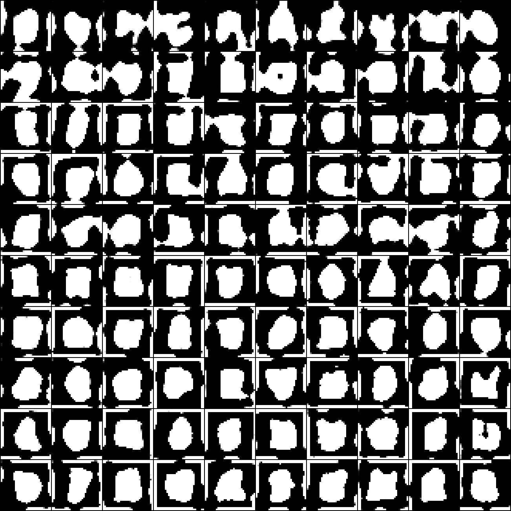

# CUDA training findings (June 2026)

## Summary

| Run | Preset | Result |
|-----|--------|--------|
| Early CUDA | `dino=0.5`, 100 epochs | Mode collapse — identical blobs |
| MNIST-tuned | `dino=0.2`, `pixel=0.06`, 20–40 epochs | Digit-like shapes emerging; S-curve attractor on some classes |
| Target | `KURAMOTO_PRESET=cloud`, 1200 epochs | Vast.ai / `train_long.sh` |

Early runs used a CIFAR-style loss mix on MNIST. **MNIST-tuned presets** (`_MNIST_LOSS_KWARGS` in `mnist_bench/digits.py`) fix this. Full Un-0 scale needs **1200 epochs on ≥8 GB GPU** — use **`cloud/vast/README.md`**.

---

## Early CUDA run (superseded)

## Run configuration

| Setting | Value |
|---------|-------|
| Dataset | Full MNIST train set (60,000 images) |
| Epochs | 100 |
| Batch size | 512 |
| Oscillators | 1024 |
| DINO weight | 0.5 |
| Pixel weight | 0.02 |
| Device | CUDA (bf16) |
| Grid candidates | 32 per digit |

Command: `./cloud/train_progress.sh` (equivalent to `make_progress_grid.py --device cuda --epochs 100 --candidates 32`).

Checkpoint written to `checkpoints/kuramoto/final.pt` (gitignored — download from the training machine or re-run locally).

## Result



**Training completed, but outputs are not recognizable digits.**

- Rows show learning over time: early epochs are noise; later epochs converge to centered grayscale blobs.
- By epoch 100, all ten columns (digits 0–9) look nearly identical — classic **mode collapse**.
- Picking the best of 32 candidates per digit (`candidates_per_digit: 32`) does not help when every candidate is the same blob.

Per-epoch rows are in [`digits/progress_rows/`](digits/progress_rows/) (`epoch_0010.png` … `epoch_0100.png`).

## What we checked

| Artifact | Status |
|----------|--------|
| `checkpoints/kuramoto/final.pt` | Present on training machine (~15 MB) |
| `digits/progress_10x10.png` | Generated from epoch snapshots — **committed here** |
| `digits/0.png` … `9.png` | **Stale** — from an earlier Mac preview run, not from this CUDA checkpoint |
| `digits/manifest.json` | **Stale** — still points at an old `mps` checkpoint |

Re-export final digits from the CUDA checkpoint:

```bash
python make_digits.py --skip-train --device cuda --candidates 32
```

## Kuramoto vs DCGAN

This repo trains two different generators:

| | **Kuramoto (Un-0)** | **DCGAN** |
|---|---|---|
| Objective | Drift loss (DINO + pixel matching) | Adversarial (generator vs discriminator) |
| Discriminator | None | ConvNet critic |
| Entry point | `train_kuramoto.py` | `train_dcgan.py` |

Kuramoto is **not** a GAN. The CUDA preset uses a CIFAR-tuned drift objective; on MNIST it learned “bright blob in the center” without digit-specific structure.

## Likely causes

1. **Loss mix** — high DINO weight (0.5) and low pixel weight (0.02) may be wrong for simple 28×28 digits; Mac preset uses `dino_weight=0.2`, `pixel_weight=0.06`.
2. **Epoch budget** — `train_kuramoto.py` defaults to 400 epochs; CUDA preset overrides to 100.
3. **Anti-collapse off** — `collapse_weight=0.0` in `CUDA_TRAIN_KWARGS`.
4. **No adversarial signal** — drift loss alone may not enforce class-specific stroke structure the way a discriminator does.

## Recommended next steps

**Fast path to readable digits (traditional GAN):**

```bash
python train_dcgan.py --device cuda --epochs 200
python scripts/generate_synthetic_digits.py \
  --model dcgan --checkpoint checkpoints/dcgan/final.pt --per-class 100
```

**Stay on Kuramoto — retune before retraining:**

```bash
python train_kuramoto.py --device cuda --epochs 400 \
  --dino-weight 0.2 --pixel-weight 0.06 --channel-weight 0.1 \
  --collapse-weight 0.01 --snapshot-every 10
```

Compare both models:

```bash
python eval/compare.py \
  --kuramoto checkpoints/kuramoto/final.pt \
  --dcgan checkpoints/dcgan/final.pt
```

## Manifest

Grid metadata: [`digits/progress_10x10.json`](digits/progress_10x10.json)
